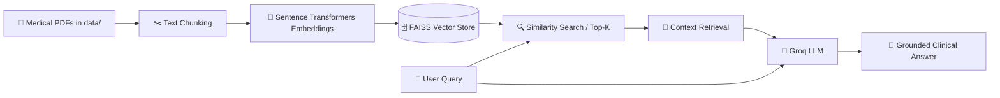

# 🩺 MediQuery RAG — Clinical Reference AI Assistant

<p align="center">
  
  
  
  
  
</p>

---

## 📌 Introduction

**MediQuery RAG** is an intelligent, context-aware medical assistant built on a **Retrieval-Augmented Generation (RAG)** architecture. It bridges clinical reference literature (such as medical encyclopedias and research papers) with high-speed LLM inference, enabling accurate, source-grounded answers while minimizing hallucinations.

### 🌟 Why MediQuery?
- **Grounded Responses**: Answers are retrieved strictly from validated medical literature stored in the FAISS vector index.
- **Ultra-Fast LLM Inference**: Powered by Groq's LPU engine for near-instant responses.
- **Modular & Extensible**: Seamlessly swap embedding models, document collections, or LLM providers.
- **Interactive UI & CLI**: Choose between a modern Streamlit web interface or an interactive command-line interface.

---

## 🏛️ System Architecture



---

## 📂 Project Structure

```bash
mediquery-rag/
├── data/                               # Store your source PDF medical documents
│   └── The_GALE_ENCYCLOPEDIA_of_MEDICINE_SECOND.pdf
├── vectorstore/                        # Persisted FAISS vector index files
│   └── db_faiss/
├── create_memory_for_llm.py           # Ingestion script (PDF loader -> Chunker -> FAISS)
├── connect_memory_with_llm.py         # Terminal / CLI interactive query tool
├── mediquery.py                        # Streamlit web chat application
├── requirements.txt                    # Python package dependencies
├── pyproject.toml                      # Project metadata & environment configuration
└── README.md                           # Documentation
```

---

## 🚀 Quickstart & Installation

### 1️⃣ Clone the Repository

```bash
git clone https://github.com/tauqeeralam11/mediquery-rag.git
cd mediquery-rag
```

### 2️⃣ Create & Activate Virtual Environment

**On Windows (PowerShell):**
```powershell
python -m venv .venv
.venv\Scripts\Activate.ps1
```

**On Linux / macOS:**
```bash
python3 -m venv .venv
source .venv/bin/activate
```

### 3️⃣ Install Dependencies

You can install dependencies via `pip` or `uv`:

```bash
# Using standard pip
pip install -r requirements.txt

# Or using uv (ultra-fast)
uv sync
```

---

## 🔑 Environment Configuration

1. Get a **free Groq API Key** from the [Groq Console](https://console.groq.com/keys).
2. Create a new file named `.env` in the project root directory.
3. Paste your API key inside `.env`:
   ```env
   GROQ_API_KEY='your_groq_api_key_here'
   ```

---

## 📚 Step-by-Step Usage

### Step 1: Ingest Documents & Build Knowledge Base

Place your medical PDFs inside the `data/` directory, then run:

```bash
python create_memory_for_llm.py
```
*This will parse the PDFs, chunk the text into optimal overlapping segments, generate semantic embeddings (`sentence-transformers/all-MiniLM-L6-v2`), and persist the FAISS index to `vectorstore/db_faiss`.*

---

### Step 2: Launch the MediQuery Web Application

Start the Streamlit interface:

```bash
streamlit run mediquery.py
```
Open your browser and navigate to `http://localhost:8501`.

---

### Step 3: Run via Command Line Interface (CLI)

If you prefer testing queries directly in the terminal:

```bash
python connect_memory_with_llm.py
```

---

## 🛠️ Technology Stack

| Component | Technology | Description |
|---|---|---|
| **Framework** | [LangChain](https://www.langchain.com/) | Orchestrates RAG retrieval, prompt chains, and LLM communication |
| **Vector Database** | [FAISS](https://github.com/facebookresearch/faiss) | High-performance similarity search for dense vector embeddings |
| **Embeddings** | [HuggingFace Sentence-Transformers](https://huggingface.co/sentence-transformers) | `all-MiniLM-L6-v2` dense vector representations |
| **LLM Provider** | [Groq](https://groq.com/) | Ultra low-latency inference engine |
| **Web Interface** | [Streamlit](https://streamlit.io/) | Interactive chat UI |

---
## ⚠️ Medical Disclaimer

> **IMPORTANT**: **MediQuery RAG** is developed for informational, educational, and research purposes only. It is **not** a diagnostic tool and does not provide formal medical advice, clinical diagnoses, or treatment recommendations. Always consult a certified healthcare professional for medical concerns.

---
